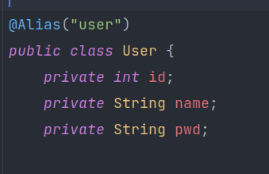
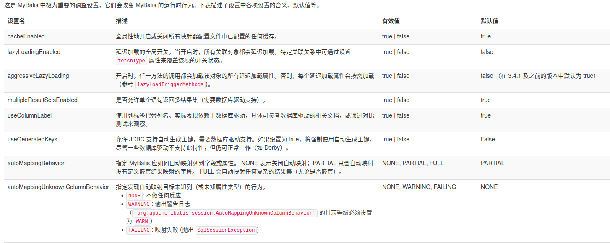
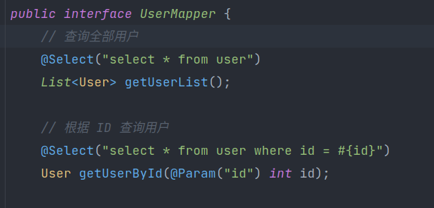

## 模糊查询怎么写？
1. Java代码执行的时候，传递通配符 %   %
2. 在SQL拼接中使用通配符！

---
## Mybatis配置文件<br>
db.properties  
```xml
<properties resource="db.properties">
    <property name="username" value="root"/>
</properties>
```
- 可以直接引入外部配置文件
- 可以在其中添加一些属性配置
- 如果两个文件有同一个字段，优先使用外部配置文件的！
---
## 实体类别名
```xml
<!--    实体类别名-->
    <typeAliases>
<!--    第一种    自定义-->
        <typeAlias type="com.zxf.pojo.User" alias="User"/>
<!--    第二种    不加注解时：包下的小写类名； 加注解时为注解的值-->
        <package name="com.zxf.pojo"/>
    </typeAliases>
```

注解如图  

---
## 设置
  
一个配置完整的 settings 元素的示例如下：
```xml
<settings>
  <setting name="cacheEnabled" value="true"/>
  <setting name="lazyLoadingEnabled" value="true"/>
  <setting name="multipleResultSetsEnabled" value="true"/>
  <setting name="useColumnLabel" value="true"/>
  <setting name="useGeneratedKeys" value="false"/>
  <setting name="autoMappingBehavior" value="PARTIAL"/>
  <setting name="autoMappingUnknownColumnBehavior" value="WARNING"/>
  <setting name="defaultExecutorType" value="SIMPLE"/>
  <setting name="defaultStatementTimeout" value="25"/>
  <setting name="defaultFetchSize" value="100"/>
  <setting name="safeRowBoundsEnabled" value="false"/>
  <setting name="mapUnderscoreToCamelCase" value="false"/>
  <setting name="localCacheScope" value="SESSION"/>
  <setting name="jdbcTypeForNull" value="OTHER"/>
  <setting name="lazyLoadTriggerMethods" value="equals,clone,hashCode,toString"/>
</settings>
```
## 生命周期和作用域
生命周期 和 作用域 是至关重要的，因为错误的使用会导致非常严重的并发问题。  
**SqlSessionFactoryBuilder**  
- 一旦创建了 SqlSessionFactory，就不再需要它了。
- 局部变量  

**SqlSessionFactory**
- 数据库连接池
- SqlSessionFactory 一旦被创建就应该在应用的运行期间一直存在，没有任何理由丢弃它或重新创建另一个实例。
-  SqlSessionFactory 的最佳作用域是应用作用域
- 最简单的就是使用单例模式或者静态单例模式

**SqlSession**  
- 连接到连接池的一个请求
- SqlSession 的实例不是线程安全的，因此是不能被共享的，所以它的最佳的作用域是请求或方法作用域
- 用完之后需要赶紧关闭，否则资源被占用

---
## 属性名和字段名不一致的问题
- 起别名  
```xml
<select id="getUserList" resultType="com.zxf.pojo.User">
    select id, name, pwd as password from mybatis.user;
</select>
```
- resultMap 结果集映射
```xml
    <resultMap id="UserMap" type="User">
<!--        column数据库中的字段，property实体类中的字段-->
<!--        <result column="id" property="id"/>-->
<!--        <result column="name" property="name"/>-->
        <result column="pwd" property="password"/>
    </resultMap>
    
    <select id="getUserList" resultMap="com.zxf.pojo.User">
        select * from mybatis.user;
    </select>
```
---
## 日志
标准日志输出
```xml
<settings>
  <setting name="logImpl" value="STDOUT_LOGGING"/>
<setting/>
```
### log4j

---
## 分页
1. sql层面  limit
2. 代码层面  面向对象

---
## 注解开发



