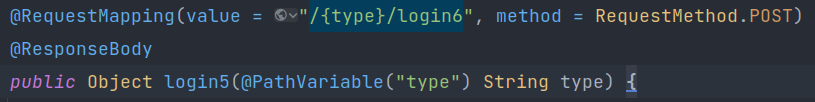
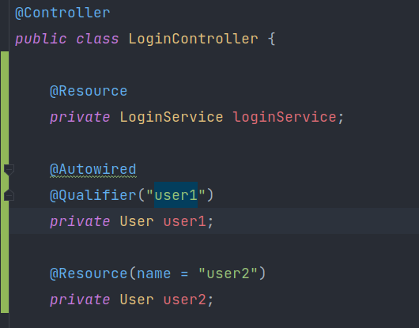

原理：反射 + 字节码技术

springboot 会默认将src/main/resources下的
  1. /public
  2. /static  静态资源
  3. /templates  模板资源
  4. 其他 

会自动加载

favicon.ico会自动加载为web项目，网站url的图片

---
### 请求相关
- @RequestMapping("xxx")
    - 可以使用在类、方法上，表示客户端请求的配置（包括uri，请求方法，数据类型）
    - @RequestParam("xxx")设置Request body的内容参数，接受的数据格式
        - 不加注解，默认映射属性（变量名）
        - 类型可以是封装数据类型、自定义类型
        - 请求数据中，键和自定义类型属性匹配
        - 只接收url中的数据 + x-www-form-urlencoded(表单默认形式) + from-data
- @RequestBody: 设置请求体的 Content-Type 为 application/json
### 响应相关
- @RestController == @Controller + @ResponseBody (所有方法默认都有)
- @ResponseBody：返回的 Content-Type 响应头为 application/json
    - 不带 @ResponseBody 注解，需要返回字符串，表示静态资源路径
    
---
统一的拦截器：
- @Configuration 
  - implements WebMvcConfigurer
    - （做WebMVC的配置，都可以重写接口方法，如添加拦截器）
  - @Override
    public void addInterceptors(InterceptorRegistry registry)
  -   Interceptor implements HandlerInterceptor
    
统一的异常处理：
- @ControllerAdvice + ExceptionHandler(Exception.class) 拦截Controller 方法抛出的异常

响应体返回信息的 统一格式化
- @ControllerAdvice  + class implements ResponseBodyAdvice

---
获取请求路径中的变量
- @PathVariable

  
@Bean: 使用在方法上，表示注册一个名称为方法名的 Bean 对象到容器中 并且注册到 @Configuration 等类中
- @Autowired: Spring的注解   -- 默认根据名称
- @Resource: jdk的注解，是一个规范，Spring是实现了这个规范   -- 默认根据名字
- @Bean所在的方法，以方法参数的形式注入

  
---
AOP原理
- 在编译期间及运行期（及时编译），可以使用AOP将一些字节码植入原有代码

AOP的实现方式

动态代理   ---spring中 AOP 的实现方式
- （1）JDK 的方式 被代理类需要实现接口，基于 InvocationHandler接口 和 Proxy类生成代理类
- （2）CGlib 的方式 被代理类不需要实现接口

静态代理
- （3）Aspectj 的方式    ---spring中的Aspectj是自行封装了
---
SpringBoot怎么进行自动化配置的？
- spring的SPI机制：
    - SpringBoot提供了加载依赖包 META-INF 文件夹中，很多配置文件（如 spring。factories）的方式，来初始化配置类，以及做其他的启动时的初始化操作
    - 框架不知道你的类是什么，但是提供了接口，我们可以自己扩展接口的实现类，框架会进行解析
    
---
### Mybatis

1. ORM ：Object Relational Mapping （对象关系映射）数据表和面向对象语言中实体类对象互相映射转换
2. ORM 框架：Hibernate 、 Mybatis
3. Hibernate 和 Mybatis 的区别

Mybatis 使用（集成在SpringBoot中的使用）

